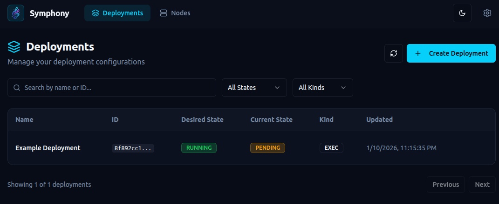
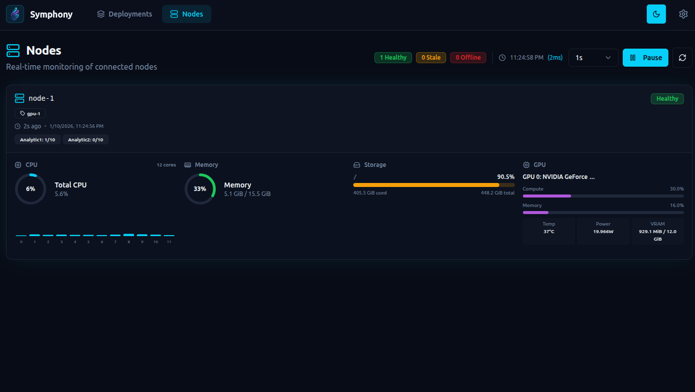

# Symphony 🎼

**Symphony** is a lightweight container and job orchestrator.

A central **Conductor** schedules Docker and exec jobs across distributed **Nodes**, balancing workloads using **virtual resource capacities** instead of raw CPU or memory.

⚠️ **Preview Version**

Symphony now has a working MVP with:
- ✅ Add deployments
- ✅ Add nodes
- ✅ UI-based configuration
- ✅ Node status with CPU/GPU/RAM usage
- ✅ Automatic scheduling based on virtual capacity availability
- ✅ Automatic restarts

---

## Current Status

- ✅ Working MVP
- ❌ No releases yet
- ⚠️ APIs and CLI are **not final**
- ⚠️ Breaking changes expected

Everything in this repository should be considered **experimental**.

---

## Why Symphony Exists

Symphony: orchestration without owning the node.

Traditional orchestrators such as Kubernetes, Nomad, Docker Swarm, and Mesos assume
host-level control, requiring cgroups, root privileges, or a container runtime on
the node. These assumptions break down in modern GPU platforms and container-only
environments such as R**Pod.

Symphony is purpose-built for these environments, operating entirely in user space,
requiring no special privileges, and running wherever a standard container can run.

### Focus

- ✅ Easy installation
- ✅ "Just run it" experience
- ❌ No special privileges
- ❌ No host / cgroups / kernel access
- ✅ Works in environments like R**Pod (container-only access)


- Container runtime only
- No root on host
- No /sys/fs/cgroup
- No iptables
- No privileged containers
- No Docker daemon inside container

This immediately disqualifies many orchestrators.

### Symphony Design Principles

- ✅ Runs as a normal user-space process
- ✅ Runs entirely inside a container
- ✅ No cgroups
- ✅ No kernel access
- ✅ No privileged mode
- ✅ No node ownership assumptions

### Installation Friction (high level)

| System | Installation steps |
| --- | --- |
| Kubernetes | Cluster setup, CRI, CNI, root, kernel config |
| Nomad | Host agent, ACLs, networking, drivers |
| Docker Swarm | Docker daemon, swarm init |
| Mesos | Zookeeper, agents, isolators |
| Symphony | pip install symphony-orchestra |

Note: This is a simplified, high-level comparison. Real-world installation steps may differ by environment.
Please open a PR if you spot inaccuracies or have improvements.

---

## Architecture

```
User / CLI
     |
     v
+-------------+
|  Conductor  |
+-------------+
       |
       | secure persistent connection (TLS)
       |
+-------------+     +-------------+
|    Node     |     |    Node     |
| (multiple)  | ... | (multiple)  |
+-------------+     +-------------+
```

---

## Core Concepts

### Conductor
The central controller responsible for:
- node registry and health
- capacity tracking
- job scheduling
- job lifecycle management

### Nodes
Nodes are clients that connect to the Conductor and can run multiple applications.

Each Node declares:
- one or more **groups** (e.g. `gpu`, `cpu`, `edge-sg`)
- **virtual capacity classes**, for example:
  ```
  A = 100
  B = 200
  ```

### Jobs
Jobs are units of work submitted to the Conductor.

When submitting a job, you specify how much capacity it consumes:
```
A10
A10,B20
```

The Conductor schedules the job to an eligible Node and balances workloads automatically.

---

## Features (v1)

- ✅ Single Conductor
- ✅ Multiple Nodes
- ✅ Node groups
- ✅ Virtual capacity classes (A/B/...)
- ❌ Docker jobs
- ✅ Exec jobs
- ✅ Virtual capacity-aware scheduling
- ❌ Balanced distribution
- ❌ Heartbeats and health checks
- ❌ Job logs and exit codes

---

## Installation & Quickstart

1. Install Symphony:

```bash
pip install symphony-orchestra
```

2. Run the Conductor:

```bash
symphony --config conductor.yaml
```

Notes:
- Certs are generated automatically if not provided.
- Store certs in a persistent location (default: `./storage`).
- Copy `ca.pem`, `node-client.pem`, and `node-client.key` to all nodes.
- WARNING: All nodes use the same client certs.

3. Run Nodes:

```bash
symphony --config node.yaml
```

Make sure each node has the required executables and files for your jobs.

4. Add deployments from the UI and they will be scheduled automatically.


Command-line options (see `src/symphony/cli.py`):

- `--config, -c` – path to YAML config file (default: `config.yaml`)
- `--mode` – override `mode` from the config (`conductor` or `node`)
- `--log-level` – override log level (`INFO`, `DEBUG`, …)

Nodes connect outbound only; no public IP is required.

---

## Configuration

### Conductor (`conductor.yaml`)

```yaml
mode: conductor

logging:
  level: DEBUG
  json: false

conductor:
  # Conductor gRPC listen address.
  listen: "0.0.0.0:50051"
  tls:
    # Folder containing TLS certs/keys for the Conductor and node client certs.
    cert_path: "storage/certs"
```

- `mode` must be `conductor`.
- `conductor.listen` is the gRPC address nodes connect to.
- `conductor.tls.cert_path` points to the directory that holds the CA, server,
  and node client certificates/keys. Missing files are generated on startup,
  but you should store them on persistent storage.

### Node (`node.yaml`)

```yaml
mode: node

logging:
  level: DEBUG
  json: false

node:
  node_id: "node-1"
  conductor_addr: "localhost:50051"
  groups: ["gpu-1"]
  capacities_total:
    Analytic1: 10
  heartbeat_sec: 3.0
  tls:
    ca_file: "storage/certs/ca.pem"
    cert_file: "storage/certs/node-client.pem"
    key_file: "storage/certs/node-client.key"
```

- `mode` must be `node`.
- `node.conductor_addr` should match the Conductor `listen` address.
- `groups` and `capacities_total` describe how the node is advertised and scheduled.
- Under `node.tls`, the node points to the CA certificate and its client
  certificate/key; these must exist for a secure connection to be created.

---

## API

Symphony exposes:

- a **gRPC stream** between nodes and the Conductor
- an **HTTP API** for deployments and node inspection

---

## Security

- gRPC uses **mutual TLS (mTLS)** between nodes and the Conductor. Both sides present
  certificates; nodes authenticate the Conductor and the Conductor authenticates nodes.
- The HTTP API is **unauthenticated and unencrypted by default**. Treat it as **open**
  and **do not expose it to untrusted networks**.
- If you must use the HTTP API outside localhost, put it behind a reverse proxy that
  enforces TLS and authentication, and/or bind it to a private network only.

### Node ↔ Conductor gRPC protocol

Defined in `proto/symphony/v1/protocol.proto`:

- Service: `ConductorService`
- RPC: `Connect (stream NodeToConductor) returns (stream ConductorToNode)`

Key message types include:

- `NodeHello` – node registration (ID, groups, capacities, static resources)
- `Heartbeat` – periodic resource usage and capacity usage
- `DeploymentReq` / `DeploymentUpdate` – deployment requests and updates
- `DeploymentStatusList` – deployment status updates from nodes

### HTTP control API

The Conductor runs a FastAPI app (see `src/symphony/conductor/api/server.py`) on:

- Host: `0.0.0.0`
- Port: `8000`

Main endpoints (see `src/symphony/conductor/api/routes.py`):

- Deployments:
  - `POST /deployments` – create a deployment
  - `GET /deployments` – list deployments
  - `GET /deployments/{deployment_id}` – get a deployment
  - `PATCH /deployments/{deployment_id}` – update desired state/specification
  - `DELETE /deployments/{deployment_id}` – delete a deployment
- Nodes:
  - `GET /nodes` – list connected nodes with their current resource snapshot

The same FastAPI app also serves a basic web UI under `/ui`.

UI location:

- `http://localhost:8000/ui`




### Example deployment spec

```json
{
  "node_group": "gpu-1",
  "capacity_requests": {
    "Analytic1": 1
  },
  "kind": "exec",
  "config": {
    "image": "http://..../image.zip",
    "env_name": "conda-env1",
    "command": [
      "python3",
      "/home/../main.py"
    ],
    "env": {
      "LOG_LEVEL": "info"
    }
  },
  "restart_policy": {
    "type": "on-failure",
    "backoff_seconds": 10
  }
}
```

Key explanations:

- `node_group` targets a specific node group label for placement.
- `capacity_requests` declares required virtual capacity units for scheduling.
- `kind` selects the workload type (`exec` or `docker`).
- `config` holds runtime details for the workload.
- `config.image` is not implemented yet.
- `config.env_name` is not implemented yet.
- `config.command` is the entry command to run inside the job.
- `config.env` defines environment variables passed to the job process.
- `restart_policy` controls how failed jobs are retried.
- `restart_policy.type` is not implemented yet.
- `restart_policy.backoff_seconds` is not implemented yet.
